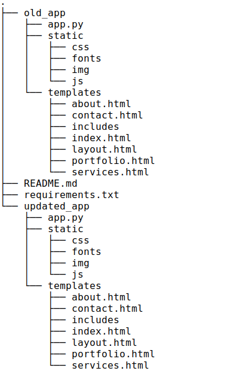

## Improve the efficiency of your Flask app's frontend

### Summary
In this talk we will discuss some performance tips you can apply to improve your Flask apps frontend.

### Description
This repo has the codes for my talk on [Improving the efficiency of your Flask frontend](https://flaskcon.com).

### Tools used for performance metrics
- LightHouse tool in Google Chrome browser's DevTools.
- WebPage Test (optional)
- Coverage tool (optional)
### Other further improvements:
- Design mobile specific frontends
- Using a reverse proxy server like NGINX to redirect traffic to 2 different app servers (1 for mobile, 1 for desktop)
- Enabling http2 on the server if possible

### Using LightHouse Tool
* Generate a report for your site's performance(both mobile and desktop devices).
* Identify and fix common problems that affects your site's performance.

### Project Tree

**AUTHOR**: Duodu Randy

Date: 1st December, 2021
